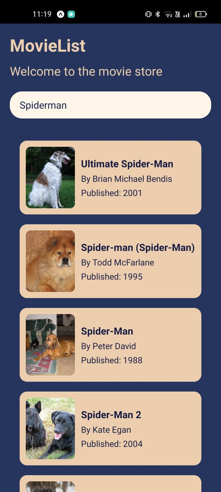

# Movie Search App

This is a React Native application built with Expo that allows users to search for movies using the Open Library API. The app displays search results with a random dog image from the Dog CEO API.

## Features

- Search for movies using the Open Library API.
- Display search results in a list with images and movie details.
- Show a loading indicator while fetching data.
- Responsive design with rounded edges for search bar and cards.
- Custom background colors for the app and cards.

## Getting Started

### Prerequisites

- Node.js and npm installed
- Expo CLI installed (`npm install -g expo-cli`)

### Installation

1. Clone the repository:
   ```
   git clone https://github.com/your-username/movie-search-app.git
   cd movie-search-app
   ```
2. Install dependencies:
  ```
  npm install
  ```
3. Start the Expo development server:
  ```
  expo start
  ```
Use the Expo app on your mobile device to scan the QR code and run the app.

### Screenshots



